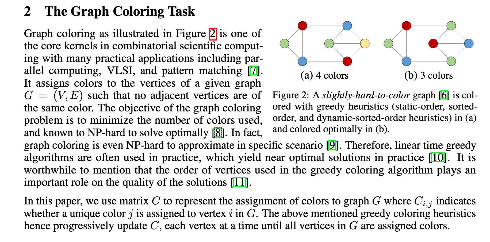
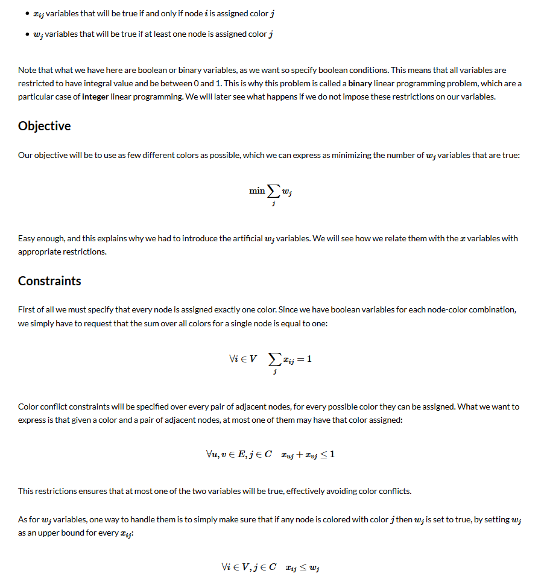

# Graph Coloring Algorithms

Here we enlist graph coloring algorithms and references, when needed.

## Offline graph coloring
### Definition of the problem
Taken from ["Coloring Big Graphs With AlphaGoZero"](https://arxiv.org/pdf/1902.10162.pdf)

## LP definition
In order to solve the problem with OR-Tools we use the following mathematical representation - 

Taken from ["modelling graph coloring with integer linear programming"](https://manas.tech/blog/2010/09/16/modelling-graph-coloring-with-integer-linear-programming/)

