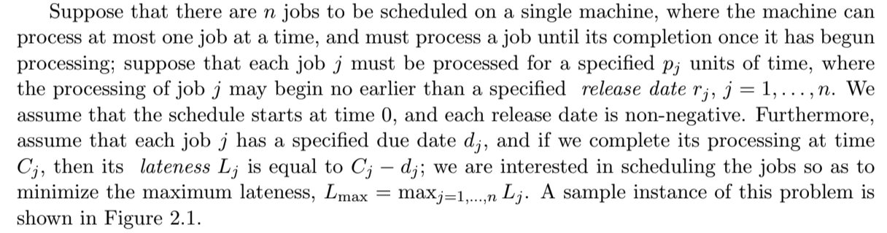

# Scheduling Algorithms

Here we enlist scheduling algorithms and references, when needed.

## Scheduling Jobs with Deadline on a single machine

### Definition of the Problem
Taken from ["The Design of Approximation Algorithms"](https://www.amazon.com/Design-Approximation-Algorithms-David-Williamson/dp/0521195276/) by  Williamson & Shmoys, pp. 36.

